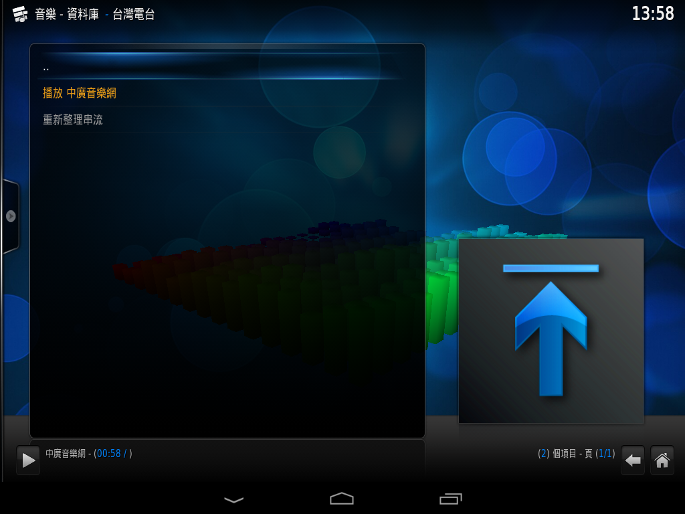

# KODI 台灣電台外掛
使用 KODI 收聽台灣電台！  
本專案使用Grok協力製作，可能代碼會有一些Bug，敬請見諒！  
  
### 注意：本外掛不負責添加所有的台灣電台，可透過下方DIY指示補全自己想聽的電台！
  
## 外掛截圖
電台選單：

  
電台選項，可供使用者刷新串流連結，或是收聽

  
附加元件選單顯示的狀況：

  
現正播放狀態示意，電台沒有現正播放曲目資訊的時候，顯示電台名稱：

  
如果有現正播放曲目資訊，會更新於現正播放狀態上：

  
## 使用方式
1. 將整個專案以 zip 格式下載下來
2. 將`plugin.audio.taiwanradio`(含資料夾)打包成`plugin.audio.taiwanradio.zip` (已經有壓縮好的版本可以直接下載！)
3. 匯入安裝 KODI 的裝置
4. 選擇 "附加元件" -> "從 zip 檔案安裝"
5. 選擇這個附加元件的 zip
6. 會在 "附加元件" 選單出現 "台灣電台" 的選單
7. 點選需要的電台 -> 播放 (電台名稱) 來收聽
  
## 如果串流失效
*  嘗試點選 "該電台名稱" -> "重新整理串流" ，該步驟會嘗試向電台來源要取新的串流連結  
   (例如 Hit FM、A-Line Radio都需要經過向來源要取串流連結的步驟)

## 新增電台指引
1. 目前版本外掛分為三種取得串流連結的模式：POST、GET、DIRECT
2. 先修改 `main.py` 中 `STATIONS` 變數，新增電台的基本資訊，以下為各種範例：   
   `GET` 模式：  
   ```pyhon
    'alineall': {
        'name': 'A-Line Radio 網路音樂台',
        'url': 'https://ipget.apple-line.com/alinePlayer.php',
        'method': 'GET',
        'desc': 'A-Line Radio 最舒服的電台'
    },
   ```
   *  `name`：電台名稱
   *  `url`：GET的目標網址
   *  `method`：`'GET'`
   *  `desc`：電台資訊，會顯示在KODI選中電台的左邊欄位
   
   `POST` 模式：  
   ```pyhon
    'hitfmnorth': {
        'name': 'Hit FM 北部',
        'url': 'https://www.hitoradio.com/newweb/hichannel.php',
        'method': 'POST',
        'post_data': 'channelID=1&action=getLIVEURL',  # 專屬 Hit FM Body
        'desc': 'Hit FM 中部流行音樂台'
    },
   ```
   *  `name`：電台名稱
   *  `url`：POST的目標網址
   *  `method`：`'POST'`
   *  `desc`：電台資訊，會顯示在KODI選中電台的左邊欄位
   *  `post_data`：需要跟伺服器溝通的Body部分內容，例如要請求甚麼電台

   `DIRECT` 模式：  
   ```pyhon
    'pbsall': {
        'name': '警廣全國治安交通網',
        'url': 'https://stream.pbs.gov.tw/live/mp3:PBS/playlist.m3u8',  # 直接串流
        'method': 'DIRECT',  # 無需 API，直接播放
        'desc': '警察廣播電台 全國治安交通網'
    },
   ```
   *  `name`：電台名稱
   *  `url`：串流連結，必須直接可在播放器播放
   *  `method`：`'DIRECT'`
   *  `desc`：電台資訊，會顯示在KODI選中電台的左邊欄位
3. 取決使用的模式，新增額外處理的函式在 `get_m3u8_url` 區塊，特別注意中段 `POST` 處理的部分，該段函式即為依照伺服器所需的 Header 格式，新增 Header 宣告以讓伺服器可正確取回串流連結
   ```python
        if station['method'] == 'GET':
            # GET 請求（A-Line 等），可能需增加規則以正確的Header請求資料
            req = urllib.request.Request(station['url'], headers=headers)
            
        elif station['method'] == 'POST':
            # POST 請求（Hit FM 等），可能需增加規則以正確的Header請求資料
            if station_id == 'hitfmnorth' or station_id == 'hitfmcentral':
                data = station['post_data'].encode('utf-8')
                headers.update({
                    'Content-Type': 'application/x-www-form-urlencoded',
                    'Content-Length': str(len(data))
                })
            else:
                data = b''  # 空 Body 預防
            
            req = urllib.request.Request(
                station['url'], 
                data=data, 
                headers=headers, 
                method='POST'
            )
        elif station['method'] == 'DIRECT':
            # 直接串流：立即返回 URL
            return station['url']

   ```
4. 將修改好的專案照使用方式的第2.步打包成 `zip` ，重開 KODI 後重新匯入試試！
  
## One more thing
另外釋出一版本依賴Python 2.7，可以用於較老的系統(如Android 4.2 + Kodi 16)，不過測試 **!!某些需安全連線的電台無法建立；以及m3u8格式的電台播放會有斷續、重播問題!!**
1. 將`xbmc.python-2.25.0.zip`與`plugin.audio.taiwanradio.old.zip`放入裝置之`/sdcard`
2. 先裝`xbmc.python-2.25.0.zip`，再裝`plugin.audio.taiwanradio.old.zip`
3. 一樣去音樂外掛程式找尋電台外掛，即可點選電台收聽！
  

  

  

  
